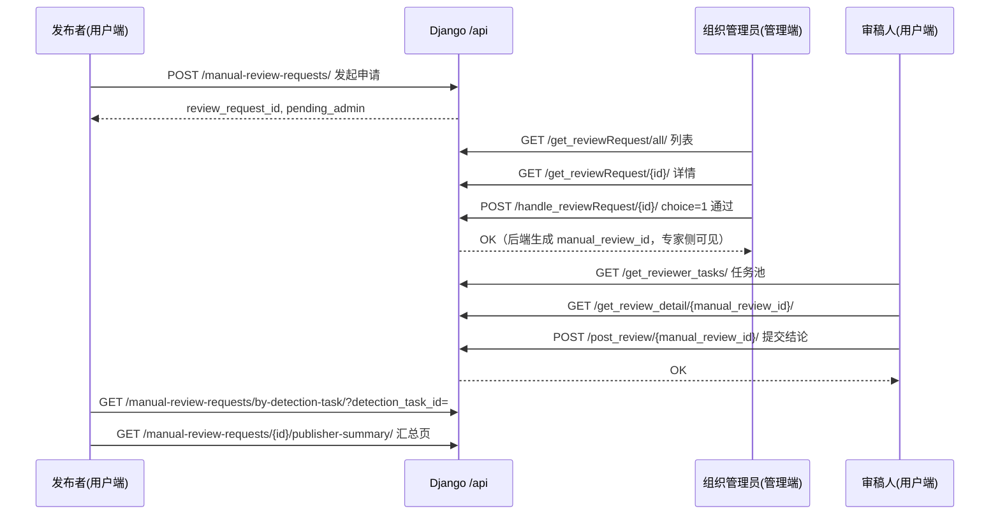

# 前后端对接 · 总览

本文是 **唯一入口级** 对接说明：约定协作方式、**API 前缀**、**人工测评（人工审核）全链路闭环**、三端角色关系与全局接口索引。  

**分项必读（仅此四份对接文档）：**

| 文档 | 读者场景 |
|------|----------|
| **本文** | 端到端流程、状态机、全局清单、Mock |
| [`前后端对接-用户端编辑模式.md`](./前后端对接-用户端编辑模式.md) | 发布者（publisher）路由与接口细节 |
| [`前后端对接-用户端专家模式.md`](./前后端对接-用户端专家模式.md) | 审稿人（reviewer）与认证/联调细节 |
| [`前后端对接-管理端.md`](./前后端对接-管理端.md) | 管理端（软件/组织管理员）接口与任务监控 |

**约定：用户端/管理端前端迭代默认不直接改后端仓库；后端按本文及分项文档在服务端实现契约。**

---

## 1. API 前缀与路径写法

- 两前端 axios 的 `baseURL` 均为 **`{origin}/api`**（例如本地 Django `http://127.0.0.1:8000/api`；用户端未配置 `VITE_API_URL` 时常为 **`/api`** 走 Vite 代理）。
- 下文除非特别声明，**路径均指去掉 `/api` 前缀后的相对段**，例如写 **`GET /get_users/`** 表示请求 **`{BASE}/api/get_users/`**。
- **认证**：除登录、注册、密码重置等公开接口外，默认 **`Authorization: Bearer <JWT>`**。

---

## 2. 三端角色与前端路由（联动基础）

| 角色 | 用户端 JWT `role`（典型） | 用户端主要路由 | 管理端 |
|------|---------------------------|----------------|--------|
| **发布者（编辑）** | `publisher` | `/upload`、`/history`、`/annual`、`/detect/*`、`/manual-review-result` | 无 |
| **审稿人（专家）** | `reviewer` | `/review`、`/task/detail/:manual_review_id` | 无 |
| **管理员** | —（管理端独立登录） | — | 工作台 `/`、检测与资源 `/tasks` `/files`、用户与组织 `/members`、审核 `/reviews`、日志 `/logs` |

用户端路由守卫（`代码/前端/前端用户端/src/router/index.ts`）：

- **审稿人** 访问发布者路径（如 `/upload`、`/history`、`/annual`、`/detect`、`/manual-review-result`、`/step`）→ 重定向 **`/review`**。
- **发布者** 访问审稿路径（`/review`、`/task`）→ 重定向 **`/upload`**。

**界面预览**（`localStorage` / Pinia `uiPreview`）：无 JWT 时可切换导航用于改 UI，**不替代真实接口行为**。

---

## 3. 人工测评（人工审核）全链路闭环

本节对应产品语义：**发布者发起申请 → 组织管理员审批 → 审稿人作答 → 发布者查看汇总**。实现上可与现有 `ReviewRequest` / `ManualReview` 模型映射，以下用 **逻辑状态** 描述，便于后端建模。

### 3.1 端到端流程（必须可实现）

### 3.2 逻辑实体与字段（建议）

| 逻辑名 | 说明 |
|--------|------|
| **人工审核申请** | 发布者针对某次 **自动检测任务** `detection_task_id` 发起；对应前端 `review_request_id`。 |
| **专家任务** | 管理端「通过」后生成，对应 **`manual_review_id`**；审稿人在任务池见到的是这一条。 |

### 3.3 状态机（与前端展示对齐）

**管理端 / 列表侧 `admin_state`（与 `reviews.vue` chips）**

| 值 | 含义 |
|----|------|
| `pending` | 待审批 |
| `refused` | 已拒绝（需 `admin_reject_reason` 或等价字段） |
| `accepted` | 已通过，已生成 **`manual_review_id`** |

**审批接口**：`POST /handle_reviewRequest/<id>/`，Body：`{ "choice": 1 | 0, "reason": "拒绝时必填" }`。

**发布者侧聚合**

| 字段 | 含义 |
|------|------|
| `admin_state` | 同上 |
| `manual_review_status` | `accepted` 后有意义：`undo`（专家未完成） / `completed`（专家已 POST） |

**专家侧列表筛选（与 `ReviewRequest` 两阶段状态对齐）**

- `review_request_status`：流程状态（如 `pending` / `in_progress` / `completed`）。
- `admin_gate_status`：管理端门闸（`pending` / `accepted` / `refused`）；**任务池仅应出现门闸已通过的任务**（与 Mock 一致）。

### 3.4 接口契约汇总（闭环专用）

以下路径均相对于 **`/api`** 前缀（见 §1）。

#### A. 发布者 · 发起

**`POST /manual-review-requests/`**

- **认证**：`role=publisher`
- **Body（JSON）**：
  - `detection_task_id`（string，必填）
  - `task_type`：`image_detection` | `paper_aigc` | `resource_check` | `review_detection`
  - `reason`（string，必填）
  - `priority`：`normal` | `urgent`（可选）
  - `batch_session_id`（string，可选）
- **响应 201 示例**：`{ "review_request_id": number, "status": "pending_admin", "message"?: string }`
- **业务**：同一 `detection_task_id` 未结案重复申请是否 409，由产品定；前端当前不拦截重复提交。

前端封装：`代码/前端/前端用户端/src/api/manualReviewWorkflow.ts` → `createManualReviewRequest`。

#### B. 发布者 · 申请列表

**`GET /get_publisher_review_tasks/`**

- 分页与筛选参数以前端 `publisher.getPublisherReviewTasks` / `annual.vue` 为准。
- 建议每条包含：`review_request_id`、`detection_task_id`、`task_type`、`admin_state`（或与现有 `status` 映射）、进度展示字段。

#### C. 发布者 · 按检测任务查进度（历史详情联动）

**`GET /manual-review-requests/by-detection-task/`**

- **Query**：`detection_task_id`（必填）
- **200 找到**：`{ "found": true, "review_request_id", "detection_task_id", "task_type", "admin_state", "manual_review_id"?, "manual_review_status", "admin_reject_reason", "created_at" }`
- **200 未找到**：`{ "found": false, "detection_task_id" }`（前端对异常 catch 也会当作无数据）

#### D. 发布者 · 结果汇总页

**`GET /manual-review-requests/<review_request_id>/publisher-summary/`**

- 仅能访问 **本人** 申请。
- 响应需覆盖 `manual-review-result.vue` 使用字段，建议至少包含：`review_request_id`、`detection_task_id`、`task_type`、`admin_state`、`manual_review_status`、`manual_review_id`、`summary`（对象）、`reviewerRows[]`、`imageRows[]`（论文/Review 可无逐图行）。

#### E. 管理端 · 审批

| 方法 | 路径 | 说明 |
|------|------|------|
| GET | `/get_reviewRequest/all/` | 分页列表；建议含 `detection_task_id`、`task_type`、`reason` |
| GET | `/get_reviewRequest/<id>/` | 详情 |
| POST | `/handle_reviewRequest/<id>/` | Body：`choice` 1=通过 / 0=拒绝；拒绝 `reason` 必填 |

前端：`代码/前端/前端管理端/src/api/review.ts`、`pages/reviews.vue`。

#### F. 专家 · 任务池与作答

| 方法 | 路径 | 说明 |
|------|------|------|
| GET | `/get_reviewer_tasks/` | `role=reviewer`；仅返回管理已通过门闸的任务 |
| GET | `/get_review_detail/<manual_review_id>/` | 本人任务；含 `imgs` 或论文/Review 的 `segments`/`text_units`、`review_request`、`ai_detection_result`、`manual_review_status` 等 |
| POST | `/post_review/<manual_review_id>/` | 提交鉴定结果；成功后 `manual_review_status=completed` |

前端：`代码/前端/前端用户端/src/api/reviewer.ts`、`pages/review.vue`、`pages/task/detail/[manual_review_id].vue`。

**字段细则（分页、筛选、`task_kind` 枚举统一）**见 [`前后端对接-用户端专家模式.md`](./前后端对接-用户端专家模式.md)。

### 3.5 无后端联调（Mock）

1. 用户端 `.env`：`VITE_USE_MOCK_MANUAL_REVIEW_WORKFLOW=true`
2. 与用户端 **同源同端口** 时，管理端也可开 Mock 读同一 `localStorage`；**不同端口（如用户端 3000 / 管理端 3001）localStorage 不互通**，无后端时请在用户端 **`/annual`** 使用 **「模拟管理端审批」** 推进状态。
3. 共享实现文件：**`代码/前端/shared/manualReviewWorkflowMock.ts`**（Vite alias **`@workflow-mock`**，用户端与管理端均已引用）。

**更细的操作步骤**（终端命令逐条、编辑→管理端→专家→编辑闭环、甲乙两种联调模式）见专门文档：**[《前端联调闭环操作手册》](./前端联调闭环操作手册.md)**。

---

## 4. 全局接口索引（按域）

### 4.1 用户端 · 论文 / Review 检测

- `POST /paper/upload/`、`POST /paper/aigc/submit/`、`GET /paper/tasks/{taskId}/status/`、`GET /paper/aigc/{taskId}/result/`
- `POST /paper/resource-check/submit/`、`GET /paper/resource-check/{taskId}/result/`
- `POST /review/submit/`（Review 专项，与论文入口分离）

### 4.2 用户端 · 图像检测与历史

- `GET /user-tasks/`、`POST /detection/submit/`、`GET /tasks/{taskId}/results/`、`GET /tasks/{taskId}/fake_results/`、`GET /tasks/{taskId}/normal_results/`
- `GET /results/{resultId}/`、`GET /tasks/{taskId}/report/`（blob）、`DELETE /detection-task-delete/{taskId}/`

### 4.3 用户端 · 人工审核（旧接口兼容）

若后端仍保留旧路由，请 **语义对齐** 新契约或提供别名：

- `POST /create_review_task_with_admin_check/`（旧发起）
- `GET /get_request_detail/{review_request_id}/`、`GET /get_img_review_all/`、`GET /get_image_review/`、`GET /manual-review/{review_request_id}/report/` 等

优先实现 §3.4 **新路径**；旧路径可作为迁移期映射。

### 4.4 管理端（摘录）

- `POST /admin-login/` · `GET /admin/details/` · `POST /register/`（邀请码，非自助成为 admin）
- `GET /get_users/`、`GET /get_files/`、`GET /user_action_log/`、`GET /admin_dashboard/`
- `GET /get_all_user_tasks/`、`GET /get_detection_task_status/<task_id>/`
- `GET /dashboard/*` 图表系列  
详见 [`前后端对接-管理端.md`](./前后端对接-管理端.md)。

---

## 5. 优先级与建议联调顺序

| 优先级 | 内容 |
|--------|------|
| P0 | `paper` 上传→提交→status→result 全链路；`GET /user-tasks/` 稳定字段（含建议字段 `task_type`） |
| P0 | §3 **人工审核闭环** 全部接口与管理端审批、专家作答串联 |
| P1 | `get_all_user_tasks` 扩展字段（管理端 §2.1）；失败任务 `error_message`；汇总接口单一 schema |

---

## 6. 前端兜底行为（后端需知情）

- 任务创建后历史接口短暂未返回时，用户端可能 **localStorage** 合并展示。
- `VITE_USE_MOCK_AIGC=true` 时部分论文链路走前端 Mock。
- 人工审核 **`VITE_USE_MOCK_MANUAL_REVIEW_WORKFLOW=true`** 时全流程可走 Mock。

---

## 7. 待后端统一确认

1. `task_type` 枚举最终命名（与 `DetectionTask` 一致）。
2. 论文资源检测列表字段名：`issues` 是否固定。
3. 人工审核是否提供 **单一任务级汇总接口**（或使用 §3.4 D 即可）。
4. 错误码与文案规范，便于前端统一提示。

---

## 8. 文件预处理（论文 PDF / Review 文本）

- `POST /paper/upload/` 成功后返回 **`paragraph_count`**，表示后端已完成 PDF 解析与分段。
- `POST /review/submit/` 成功后返回 **`cleaned_text_length`**，表示文本清洗完成。
- 前端约束保持：**论文仅 PDF**、Review 在线或 **.txt**（与专项页一致）；无需前端自行解析 PDF。

---

## 9. 修订记录

| 日期 | 说明 |
|------|------|
| 2026-05-02 | 合并原《前端改造总览》《人工审核全流程》为本文；对接文档收敛为四文件。 |
